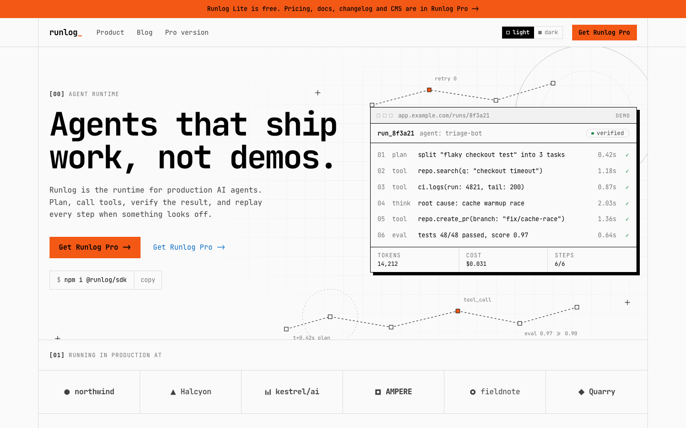

# Runlog Lite: free Astro theme for AI agent and devtool startups

A technical, monospace marketing site for AI agents, devtools and API products.
Astro 7, Tailwind CSS 4, MDX blog, light and dark themes. MIT licensed.

**Live demo:** https://runlog-lite.pages.dev



## Included

- Homepage: hero with a live agent run log, logos, steps schematic, code tabs, feature + media, stats, tools grid, testimonial, CTA
- Blog index with featured post, category filter and search, article page with table of contents
- 404 page, fixed header, full-screen mobile menu, light / dark switcher
- Sitemap, RSS-ready content, `llms.txt`, Open Graph and JSON-LD

## Quick start

```bash
npm install
npm run dev
```

## Need more? Runlog Pro

[Runlog Pro](https://runlog-astro.pages.dev) adds the pages a real launch needs:

| | Lite | Pro |
| --- | :---: | :---: |
| Home, Blog, 404 | ✓ | ✓ |
| Pricing with sticky comparison and usage estimator | | ✓ |
| Docs with sidebar, search and "Copy as Markdown" | | ✓ |
| Changelog with RSS | | ✓ |
| Contact + Thank you | | ✓ |
| Keystatic CMS | | ✓ |
| Figma source file | | ✓ |
| Commercial license, unlimited projects | MIT | ✓ |

**[Get Runlog Pro for $79 ->](https://contra.com/products/QETiOjxd-runlog-pro-ai-agent-and-dev-tool-saa-s-astro-theme)**

## Credit

Made by [Pavlo Zhydkykh](https://pzhydkykh.com). Keeping the footer credit is appreciated, not required.
